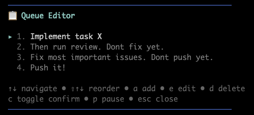

# true-queue



A task queue extension for [pi](https://github.com/badlogic/pi). Prevents the agent from seeing future tasks, so it focuses on the current one instead of rushing through it.

## The problem

When an LLM agent sees multiple tasks at once, it rushes through the early ones to get to the last one. This is well-documented (goal anchoring, completion bias). The fix is simple: don't show it the next task until the current one is done.

## How it works

You queue tasks with a `+` prefix. The agent never sees them. When it finishes the current task, the next one is sent automatically.

```
+refactor the auth module
+write tests for it
+update the docs
```

That's it. Three tasks, executed one at a time, each getting full attention.

Use `++` if you want a confirmation prompt before a task starts:

```
++deploy to production
```

## Queue editor

Press `ctrl+q` (or type `/queue`) to open the queue editor overlay. Works while the agent is running.

- `↑↓` navigate
- `⇧↑↓` reorder
- `a` add, `e` edit, `d` delete
- `c` toggle confirmation
- `p` pause/resume
- `esc` close

## Commands

```
/queue              open editor
/queue add <task>   add a task
/queue clear        clear all
/queue done         mark current done, start next
/queue skip         drop current task
/queue pause        pause auto-dequeue
/queue resume       resume
```

The agent also has an `enqueue_task` tool, so you can ask it to queue something for later.

## Install

```
pi install git:github.com/Krystofee/true-queue
```

Or try it without installing:

```
pi -e git:github.com/Krystofee/true-queue
```

